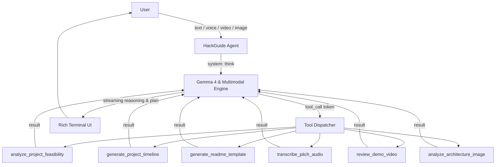

# HackGuide 🧭

> A Gemma 4-powered hackathon mentor that thinks out loud, calls real tools, and builds you a complete project plan in 30 seconds.

[](LICENSE)
[](https://ai.google.dev/gemma)
[](https://hacktoberfest.com)
[](SKILL.md)

Built at **Hacktoberfest Hack Day Asansol × HackTropica 2026**  
Asansol Engineering College, Room NB-507 | October 3, 2026

---

## 🏗️ Architecture



## 🛠️ Tech Stack

| Technology | Role |
| --- | --- |
| Gemma 4 (Apache 2.0) | Core reasoning engine — Thinking Mode + native tool calling |
| Gemini Multimodal API | Audio (voice-to-text), video demo review, and image analysis |
| Google Generative AI SDK | API interface to Gemma & Gemini |
| Python 3.11+ | Agent orchestration & CLI |
| Rich | Streaming terminal UI & chain-of-thought traces |
| PyYAML | SKILL.md frontmatter parsing |
| Agent Skill Open Standard | Modular skill architecture (SKILL.md) |

## 🚀 Quick Start

```bash
git clone https://github.com/chourasiavinit9-dev/hackguide
cd hackguide
pip install -r requirements.txt
cp .env.example .env          # add your GEMINI_API_KEY
bash scripts/run_demo.sh      # validates SKILL.md then starts the agent
```

Or manually:
```bash
export GEMINI_API_KEY=your_key_here
python skill_validator.py     # verify SKILL.md compliance first
python main.py
```

## 🎯 Prize Tracks

This project enters **both** MLH × Hacktoberfest 2026 prize tracks:

| Track | How we qualify |
| --- | --- |
| **Best Use of Gemma 4** | Native Gemma 4 tool-calling tokens + Thinking Mode (`<\|think\|>`) — not a wrapper |
| **Best Open-Source AI Project** | Fully compliant Agent Skill (SKILL.md), MIT license, public GitHub repo |

## 📊 MLH Judging Rubric

| Criterion | Implementation |
| --- | --- |
| **Technology (25%)** | Gemma 4 Thinking Mode + native `<\|tool_call>` token syntax + SKILL.md progressive disclosure |
| **Design (25%)** | Live streaming chain-of-thought traces in Rich terminal — AI thinking is visible |
| **Completion (25%)** | Pure Python CLI — zero deployment risk, runs fully offline |
| **Learning (25%)** | Agent Skill Open Standard, Gemma 4 architecture, tool-call token format |

## 📁 Project Structure

```
hackguide/
├── SKILL.md              ← Agent Skill Open Standard compliance file
├── main.py               ← Core agent loop with Gemma 4 tool calling
├── tools.py              ← 3 tool definitions + execution functions
├── skill_validator.py    ← Validates our own SKILL.md (meta-demo!)
├── requirements.txt
├── .env.example
├── LICENSE               ← MIT
└── scripts/
    └── run_demo.sh       ← One-command demo runner
```

## 👥 Team

- **Vinit Chaurasia** ([@chourasiavinit9-dev](https://github.com/chourasiavinit9-dev)) — Lead Engineer
- **Avijit Aditya** ([@Avijit010325](https://github.com/Avijit010325)) — Co-Developer

Co-authored-by: Avijit Aditya <212231507+Avijit010325@users.noreply.github.com>

## 📄 License

MIT — see [LICENSE](LICENSE)

Gemma 4 model weights are licensed under [Apache 2.0](https://ai.google.dev/gemma/terms).
